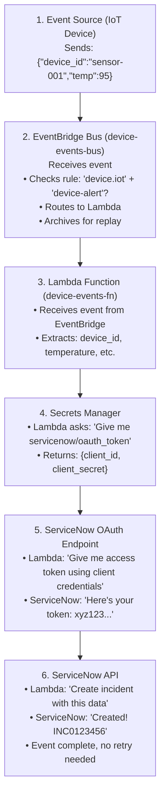
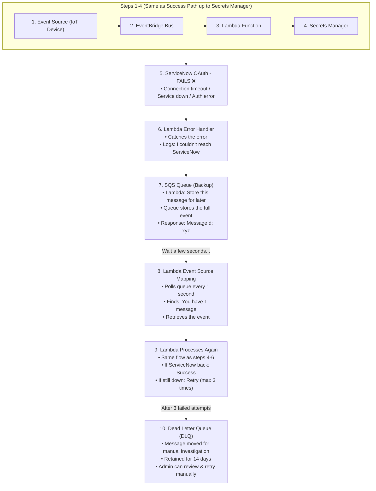
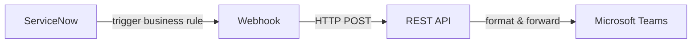
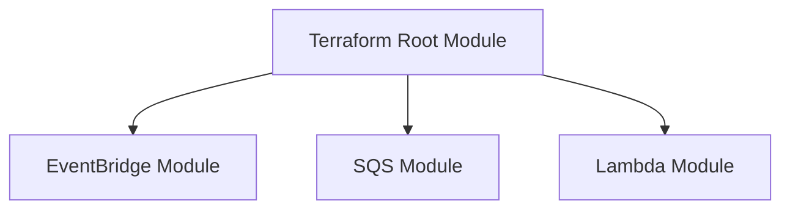

```mermaid
flowchart TD
  A["1. Event Source (IoT Device)<br/>Sends: {&quot;device_id&quot;:&quot;sensor-001&quot;,&quot;temp&quot;:95}"] --> B["2. EventBridge Bus (device-events-bus)<br/>Receives event<br/>• Checks rule: 'device.iot' + 'device-alert'?<br/>• Routes to Lambda<br/>• Archives for replay"]

  B --> C["3. Lambda Function (device-events-fn)<br/>• Receives event from EventBridge<br/>• Extracts: device_id, temperature, etc."]

  C --> D["4. Secrets Manager<br/>• Lambda asks: 'Give me servicenow/oauth_token'<br/>• Returns: {client_id, client_secret}"]

  D --> E["5. ServiceNow OAuth Endpoint<br/>• Lambda: 'Give me access token using client credentials'<br/>• ServiceNow: 'Here&apos;s your token: xyz123...'"]

  E --> F["6. ServiceNow API<br/>• Lambda: 'Create incident with this data'<br/>• ServiceNow: 'Created! INC0123456'<br/>• Event complete, no retry needed"]


```

```mermaid
flowchart TD
    subgraph S["Steps 1-4 (Same as Success Path up to Secrets Manager)"]
        A1["1. Event Source (IoT Device)"] --> B1["2. EventBridge Bus"]
        B1 --> C1["3. Lambda Function"]
        C1 --> D1["4. Secrets Manager"]
    end

    S --> E1["5. ServiceNow OAuth - FAILS ❌<br/>• Connection timeout / Service down / Auth error"]

    E1 --> F1["6. Lambda Error Handler<br/>• Catches the error<br/>• Logs: I couldn't reach ServiceNow"]

    F1 --> G1["7. SQS Queue (Backup)<br/>• Lambda: Store this message for later<br/>• Queue stores the full event<br/>• Response: MessageId: xyz"]

    G1 -. "Wait a few seconds..." .-> H1["8. Lambda Event Source Mapping<br/>• Polls queue every 1 second<br/>• Finds: You have 1 message<br/>• Retrieves the event"]

    H1 --> I1["9. Lambda Processes Again<br/>• Same flow as steps 4-6<br/>• If ServiceNow back: Success<br/>• If still down: Retry (max 3 times)"]

    I1 -- "After 3 failed attempts" --> J1["10. Dead Letter Queue (DLQ)<br/>• Message moved for manual investigation<br/>• Retained for 14 days<br/>• Admin can review & retry manually"]

```

```mermaid
flowchart LR
    SN[ServiceNow]
    W[Webhook]
    API[REST API]
    T[Microsoft Teams]

    SN -->|trigger business rule| W
    W -->|HTTP POST| API
    API -->|format & forward| T

```

```mermaid
flowchart TB
    ROOT[Terraform Root Module]
    EB[EventBridge Module]
    SQS[SQS Module]
    LAMBDA[Lambda Module]

    ROOT --> EB
    ROOT --> SQS
    ROOT --> LAMBDA
```
